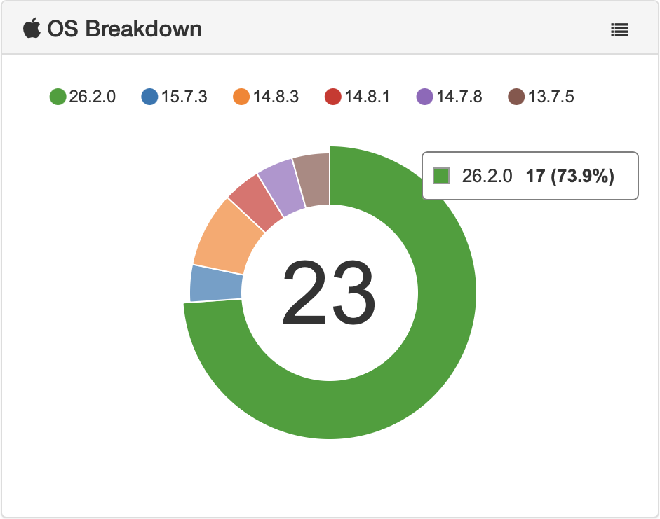

# os_donut_widget
A custom OS Breakdown widget for MunkiReport 5 to display the information in a colored donut.

> v. 1.0.6  
> January 14, 2026 
> Alex Narvey / Precursor.ca



A custom OS Breakdown widget for MunkiReport 5 to display the information in a colored donut.

You can cahnge colors by editing the values in ```var myColors```.

You show percentages instead of subtotals in ToolTips by commenting:

```	chart.tooltip.valueFormatter(function(d){```
```return (d);```

and uncommenting:

```chart.tooltip.valueFormatter(function(d){```
 ```return (d * 100/total).toFixed() + '%';```.

### Piechart

You can get a regular piechart with slices instead of a donut by changing:

```chart.pie.donut(true);```

to 

```chart.pie.donut(false);```

No warrantee is offered. Neither express nor implied. Use at your own risk.

Place in:
```munkireport-php/local/views/widgets``` folder.

And call using a .yml file ```os_donut:```

See the munkireport wiki on custom dashbaoards at: 

https://github.com/munkireport/munkireport-php/wiki/Dashboards

## Updates
• February 16, 2019 Version 1.0

• February 17, 2019 Version 1.0.1 - Arjen van Bochoven added a formatter to remove the decimal in the Tooltips and I provided an option to use percentages in Tooltips instead. Updated the graphic to show Tooltips without decimals. Provided customization instructions.

• February 17, 2019 Version 1.0.2 - Jon Crain fixed code to update when filters are applied.

• February 21, 2019 Version 1.0.3 - Add a clickback to link to the detailed view.

• April 17, 2023 Version 1.0.4 - Added a version for to display properly in munkireport 6.

• October 23, 2025 Version 1.0.5 - Altered the documentation to show how to get a piechart instead of a donut!

• January 14, 2026 Version 1.0.6 - Added a tooltip percentage calculation based on gmarnin's work on the reportdata client widget.


## Contributors
• Alex Narvey

• Arjen van Bochoven

• Jon Crain

— Alex Narvey 

precursor.ca
